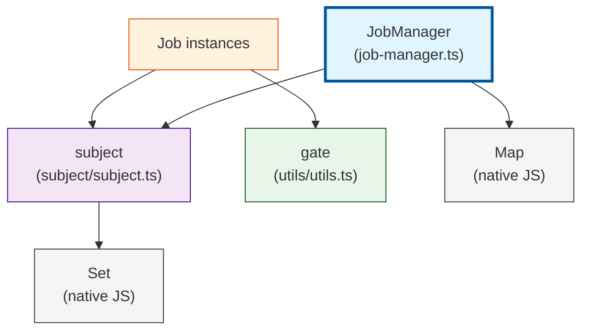

# Architecture

## Job Manager System

We use a job manager to handle concurrent asynchronous jobs across the application.

```typescript
import { JobManager } from "./job-manager/job-manager";

type CompletionState = { type: "idle" } | { type: "streaming" };
type CompletionAction = { type?: never };

export const completionJobManager = new JobManager<
  string,  // Job key (pageId)
  CompletionState,
  CompletionAction
>();
```

An initialized JobManager is a singleton service that gets imported and used throughout the application.

### Core Concepts

The job manager follows an **Actor Model** pattern where each job:
- Has its own state
- Can receive actions via `dispatch()`
- Notifies listeners of state changes
- Can be stopped independently

### Job Interface

All jobs implement the `Job` interface:

```typescript
interface Job<State, Action> {
  readonly state: State;
  dispatch(action: Action): void;
  onStateChange(listener: (state: State) => void): () => void;
  stop(): Promise<void>;
  onStopped(listener: () => void): () => void;
}
```

### Running Jobs

Jobs are created using a factory pattern. The job manager handles idempotent job creation:

```typescript
const result = completionJobManager.runJob(pageId, () =>
  simpleCompletion(input, messages, pageId)
);

// result is either:
// { type: "JOB_CREATED" } - new job was started
// { type: "JOB_ALREADY_RUNNING" } - job already exists for this key
```

No explicit state checking is needed - `runJob()` is idempotent and safe to call repeatedly.

### Accessing Running Jobs

```typescript
const job = completionJobManager.getRunningJob(pageId);

if (job) {
  // Check current state
  console.log(job.state);

  // Listen to state changes
  const unsubscribe = job.onStateChange((state) => {
    console.log("State changed:", state);
  });

  // Stop the job
  await job.stop();

  // Listen for job completion
  job.onStopped(() => {
    console.log("Job stopped");
  });
}
```

### React Integration

The `useCompletionJob` hook provides React integration:

```typescript
function useCompletionJob(pageId: string) {
  const [jobState, setJobState] = useState(/* ... */);
  const [job, setJob] = useState(/* ... */);

  useEffect(() => {
    const currentJob = completionJobManager.getRunningJob(pageId);

    if (currentJob) {
      setJob(currentJob);
      setJobState(currentJob.state);

      const unsubscribeState = currentJob.onStateChange(setJobState);
      const unsubscribeStopped = currentJob.onStopped(() => {
        setJobState({ type: "idle" });
        setJob(undefined);
      });

      return () => {
        unsubscribeState();
        unsubscribeStopped();
      };
    } else {
      setJobState({ type: "idle" });
      setJob(undefined);
    }
  }, [pageId]);

  return {
    state: jobState,
    job,
    isJobActive: job !== undefined,
    isStreaming: jobState.type === "streaming",
  };
}
```

### Creating Jobs

Jobs are created by returning an object that implements the Job interface:

```typescript
export const simpleCompletion = (
  input: string,
  messages: Message[],
  jobKey: string
): Job<CompletionState, CompletionAction> => {
  const stopGate = gate();
  const stateSubject = subject<CompletionState>();
  let currentState: CompletionState = { type: "idle" };
  let abortController = new AbortController();

  // Start async work immediately
  (async function () {
    // ... perform work ...
    currentState = { type: "streaming" };
    stateSubject.next(currentState);
    // ... complete work ...
    stopGate.open();
  })();

  return {
    get state() { return currentState; },
    dispatch(_action) { /* handle actions */ },
    onStateChange: stateSubject.listen,
    stop: async () => {
      abortController.abort();
      stopGate.open();
    },
    onStopped: stopGate.listen,
  };
};
```

## JobManager Architecture

### Dependency Graph



### Key Components

- **JobManager**: Manages multiple concurrent jobs, each identified by a unique key
- **Job**: Individual unit of work implementing the Job interface
- **subject**: Lightweight event emitter for state changes
- **gate**: One-time barrier mechanism for job completion signaling

## Benefits Over Previous System

The new JobManager system offers several advantages:

1. **Simpler API**: No state machine nodes - direct access to jobs and state
2. **Idempotent operations**: `runJob()` can be called safely without state checks
3. **No RxJS dependency**: Uses simple event emitters instead of Observables
4. **More flexible**: Jobs can maintain any state structure, not limited to idle/running
5. **Cleaner type system**: No complex discriminated unions for state nodes
6. **Better separation**: Job logic is isolated from the management infrastructure

## Migration Notes

This system replaces the previous `createTaskRunnerRepository` pattern which used:
- State machine nodes with explicit idle/running states
- RxJS Observable-based tasks
- Complex pub-sub with resource registry
- State checks before running tasks (`if (stateNode.type === "idle") stateNode.run(...)`)

The new system eliminates these complexities while maintaining all functionality.
