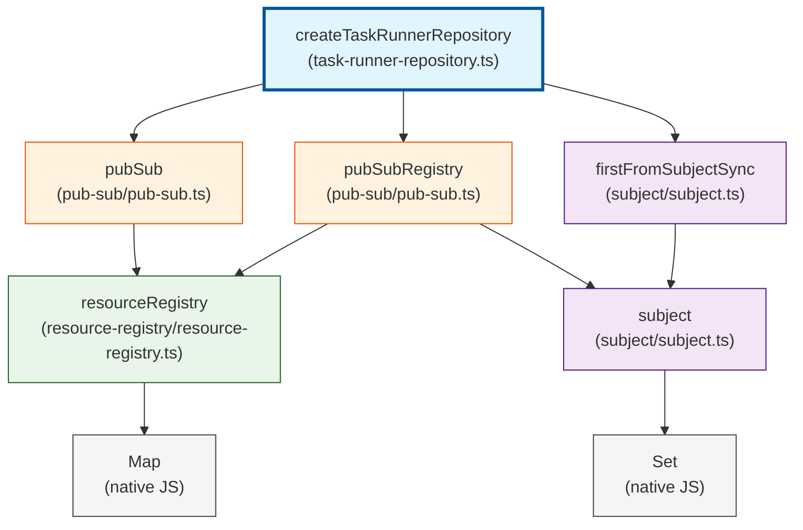

# Architecture

We have a repository of agents.

```typescript
type RunningState = { type: "streaming" };

export const runnerRepository = createTaskRunnerRepository<
  string,
  RunningState
>();
```

An initialized task runner repository will always be a singleton service that gets imported and used.

A task runner repository has multiple task runners, each associated with a key. Each task runner can run at most one task.

For this reason, a task runner actually doesn't allow running any tasks without proper checks and balances, and we leverage TypeScript's type system for enforcing that (not perfect; future work is needed to ensure read-only and write-only locks).

```typescript
const stateNode = runnerRepository.getTaskRunnerStateNode(key);

// TypeScript will raise a compiler error if we attempt to invoke
// directly`job.start`. We first need to see if it's idle and ready.
if (stateNode.type === "idle") {
  stateNode.run(task);
}
```

Jobs can also be stopped.

```typescript
if (stateNode.type === "running") {
  stateNode.stop();

  // If the reason to stop is because there was an error, then a parameter can
  // be passed
  //
  // job.stop(new Error('An error occurred'));
}
```

A task has the following signature:

```typescript
type Task<JobKey, RunningState> = ({
  jobKey: JobKey,
  abortSignal: AbortSignal,
}) => Observable<RunningState>;
```

We can also listen to state changes.

For example:

```typescript
runnerRepository.listen(key, (state) => {
  // State is either an Idle state or Running<unknown> state.
});
```

## TaskRunnerRepository

Here is the dependency graph of it all.


